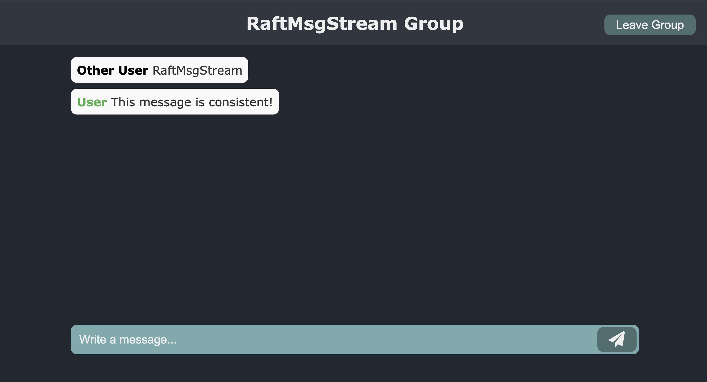

  

 

## RaftMsgStream
A Proof-of-Concept in Go for a message streaming distributed system that ensures consistency across configurable servers through the Raft algorithm.

In addition, a SPA is provided, encompassing all major features.

## Documentation
[Technical Report](https://github.com/GianlucaBresolin/RaftMsgStream/blob/master/TechnicalReport.pdf), elaborated for the exam of the course "Runtimes for distribution and concurrency", attended at the University of Padua. Here you can find the design choices that led to the implementation of the project, with considerations on scalability, the Go Runtime, and the Raft algorithm.

Other details can be founded in the integration [Integrazione Scritta](https://github.com/GianlucaBresolin/RaftMsgStream/blob/master/IntegrazioneScritta.pdf) (written in Italian) which provides some further considerations on interesting aspects of the Raft algorithm and the Go runtime.
